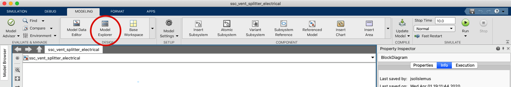
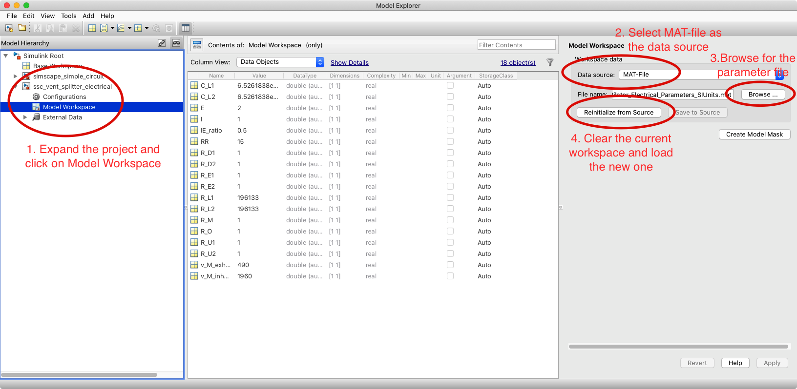

# Instructions to load parameters into electrical analogue model for ventilator splitter

This document will help you load the necessary parameters into the electrical
model with a few simple steps. A MATLAB m-file is used to create a data MAT-file
with the necessary variables. Such MAT-file will then be loaded into the simscape
model.

## 1. In MATLAB
+ Open the `setInitialParameters.m` file. It is a MATLAB script with a number of
cells, separated by `%%`, which can be run independently.

+ To create a new set of parameters, copy the following code, including the
cell delimiter (`%%`) at the top.

```Matlab
%% New parameter cell [CHANGE THIS FOR A SUITABLE NAME]  
% First, clear any parameter from this model that might be in the workspace
clear v_M_exhale v_M_inhale R_M R_U1 R_U2 R_D1 R_D2 R_L1 R_L2 C_L1 ...
    C_L2 R_E1 R_E2 R_O RR I E IE_ratio;

% Set the parameters... [CHANGE DEPENDING ON THE EXPERIMENT]
v_M_exhale = 5;% Pa PEEP = 5cmH20
v_M_inhale = 20; % PIP = 20cmH2O
R_M = 1; % Pa*s/m^3
% current = m^3/s
% charge = m^3
% tube length = 1.5 m?
R_U1 = 1;
R_U2 = 1;
R_D1 = 1;
R_D2 = 1;

R_L1 = 1e2; % want 2.0cmH2O/L/s
R_L2 = 1e2;
C_L1 = 1e-3; % 0.064 L/cmH2O into m^3/Pa
C_L2 = 2e-3;

R_E1 = 1;
R_E2 = 1;
R_O = 1;

RR = 15;
I = 1;
E = 2;
IE_ratio = I/E;

% ... and save them with a useful name
save('New_Parameter_File'); % change this for something suitable
```

+ Once having copied the code and set the parameters, run the new cell with
either the button called **Run Section** or by typing CTRL+ENTER.

## 2. In Simulink

+ Open the file `ssc_vent_splitter_electrical.slx`.

+ Go on the **MODELING** tab and click on the **Model Explorer** ad shown below



+ From the **Model Hierarchy**, at the right, expand the `ssc_vent_splitter_electrical`
tab; and select the **Model Workspace**.

+ Then, select MAT-file as the data source and select the file you just created
with the previous script.

+ Finally, click the **Reinitialize from source** button, which clears the
current parameters and loads the new ones.

+ Close the Model explorer and you can run the simulation with the Run button.

The figure below shows the model explorer and the series of steps needed are
indicated.


